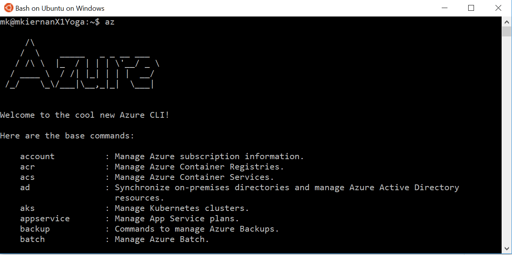
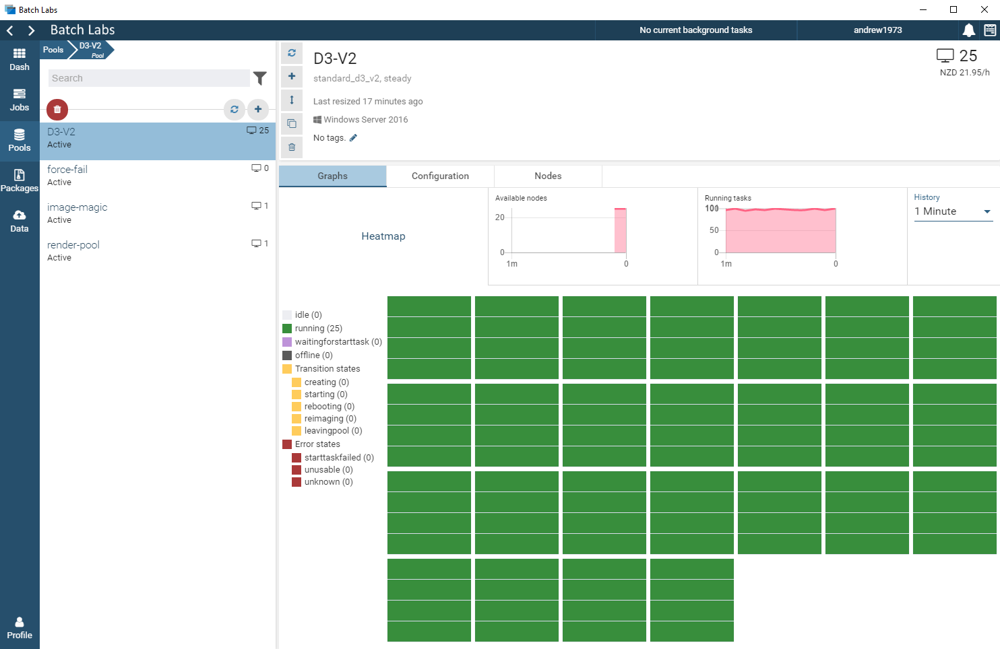

# Step 1: Get Tooled Up for Azure Big Compute #

Before you begin to work with Azure Big Compute & HPC, we recommend that you take a few minutes to download and install some relevant Azure client side tools that will make working with Azure a lot faster and easier (and more fun)! These utilities can either be installed on your laptop, or you can provision a  linux or windows VM in Azure, and install them there. 

Most of these tools are universal and run on Linux, Windows or MacOS. 

If you are looking for a quick platform to start working with Big Compute, then the <a href="https://github.com/azurebigcompute/BigComputeBench">BigComputeBench</a> ARM template is a great way to get started fast. 

***
## Universal & Essential Tools: 

### Linux & Bash From Your Windows Desktop

If you're going to be using Linux and you are using Windows 10 or later on your desktop, it's a good idea to install the new Linux/Bash capability. Find the instructions <a href="https://msdn.microsoft.com/en-us/commandline/wsl/install-win10">here</a> and <a href="https://www.windowscentral.com/how-install-bash-shell-command-line-windows-10">here</a>. You can run bash in the old CMD/DOS shell, but for a much more Linux-native experience, run the Ubuntu or SUSE shells directly (search in the start menu for eg: Ubuntu): 

### Azure CLI - Command Line Interface to manage your Azure datacenter. 

Azure CLI is THE tool to interact with Azure from the command line. You can use to create objects such as virtual machines, networks, scale-sets & clusters, storage, disks, and so on. Azure CLI download and instructions are available <a href="https://docs.microsoft.com/en-us/cli/azure/install-azure-cli">here.</a>

Note that you can also invoke Azure CLI via the<a href="https://azure.microsoft.com/en-us/features/cloud-shell/">cloud shell</a> from the <a href="https://portal.azure.com">azure portal</a>.

***
## Storage & Data Management Tools:

### Storage Explorer - Utility to help you interact with Azure Storage & Your Data

StorageExplorer is a feature-rich graphical tool for managing Azure Storage resources & data securely. Grab it from <a href="http://storageexplorer.com">storageexplorer.com</a>

* Copy Data to and from Azure, and across Azure storage containers & subscriptions. 
* Share datasets and collaborate with your colleagues inside & outside your organization

### AzCopy - Utility for copying large datasets in and out of Azure efficiently. 
Azcopy is a utility for copying and moving files around to and from Azure or between Azure storage containers. It's very efficient at copying large datasets comprised of large files or 1000's of small files, and can easily be incorporated into scripts. It's also embedded into StorageExplorer as the copy engine there. Use AzCopy 10+ in preference to slower alternatives such as blobxfer, az storage upload, and the older AzCopy pre version 10 - you'll find it much higher performant and more efficient at saturating links to upload/download data to and from azure as quickly as possible. 

* <a href="https://github.com/Azure/azure-storage-azcopy">Download & execution instructions for AzCopy.</a>

***
## Azure Batch Tools

These days most of what you need for the common Azure Batch tasks is included in the Azure Batch CLI (see above) under the "az batch" sub-command. However, for the labs we will need some extra tools normally reserved for black belts: 

### Batch Labs - Interactive Graphical Tool for Managing Azure Batch
Batch Labs is THE graphical tool for interacting with Azure Batch, and replaces the old Batch Explorer tool. You can <a href="https://azure.github.io/BatchLabs/">download the latest build</a> for your operating system. Batch Labs source code is also online <a href="https://github.com/Azure/BatchLabs">here</a>.

### Azure Batch Shipyard - Deploy Containers at Scale
Batch Shipyard is a set of client-side tools that makes running container based Big Compute jobs on Azure Batch a breeze. Information and overview <a href="https://azure.github.io/batch-shipyard">here</a>. Clone the <a href="https://github.com/Azure/batch-shipyard">github repository</a> to your workstation and follow the install instructions linked on the main README. 

### Azure Batch CLI Extensions (Preview) - Task Factory, JSON Templates & More
The <a href="https://github.com/Azure/azure-batch-cli-extensions">Batch CLI Exensions</a> provide a bunch of new advanced functionality for Azure Batch from the CLI including shipyard style templates, Task Factory, automated file upload/download and new package management features. After installing Azure Batch CLI, follow the instructions on the github README to install the extensions. 

***

## Universal Azure Automation & Development Tools

### Github & ARM Templates

In case you hadn't heard, infrastructure in the cloud is nothing but CODE. In Azure we call it ARM - Azure Resource Manager. 

Get yourself a <a href="https://github.com/join">github account</a>. You'll find lots and lots of example templates, including plenty for HPC: 

* <a href="https://github.com/Azure/AzureStack-QuickStart-Templates">General Azure Examples Repository</a>
* <a href="https://github.com/tanewill/5clickTemplates">5 Click Templates for HPC Clusters & Apps</a>
* <a href="https://github.com/xpillons/azure-hpc/tree/master/Compute-Grid-Infra">Production HPC Cluster Deployment</a>
* <a href="https://github.com/mkiernan/FlexHPC">Simple, Flexible Modular, Multi-OS HPC Deployment</a>

### Visual Studio Code & Visual Studio

If you want to getting into coding for Azure, here are two great expert tools that have direct Azure & Github integration: 

* <a href="https://code.visualstudio.com/">Visual Studio Code</a> is a free and lightweight version of Visual Studio, and is great for rapid code editing and github integration.  
* <a href="https://www.visualstudio.com/">Visual Studio</a> is the most comprehensive IDE on the planet, with cloud and mobile integration. This tool is a must for serious developers. 
